# 🔍 AI-Era Candidate Authenticity & Evaluation Engine

A **$0-infrastructure**, open-source Proof-of-Concept that turns public GitHub telemetry into an
explainable **building-depth and authenticity signal** for technical hiring — because in a world
where anyone can generate a polished-looking repo in an afternoon, raw repo count and clean
READMEs have stopped being useful signals.

> ⚠️ **This is a pre-screen signal, not a hiring decision.** Every score ships with the raw
> evidence behind it. See [`PRD.md`](./PRD.md) for scope and [`JOURNAL.md`](./JOURNAL.md) for
> the design decisions (including places an AI-assisted first draft got it wrong and was corrected).

---

## What it does

Given a GitHub username or public repo URL, it:

1. **Ingests** commit history, timestamps, pull requests, and file-tree structure via the free
   public GitHub REST API.
2. **Detects red flags** deterministically in plain Python — no LLM required for this part:
   - 🚩 **Single-day dumps** — most commits land in one dense 24h window relative to the repo's history
   - 🚩 **Flat structure** — many files, no real directory layering (single-file-style architecture)
   - 🚩 **No PR history** — commit volume with zero pull request / review workflow
   - 🚩 **Generic commit messages** — "update", "fix", "wip" with no descriptive content
3. **Scores depth & authenticity (1–10)** using a **hybrid** approach: a deterministic rule-based
   score (always available, always explainable) optionally narrated and lightly adjusted (±2 max)
   by a free-tier LLM (Groq Llama 3.3, with Gemini as a fallback). The LLM can never author the
   score outright — see [`JOURNAL.md` Entry 5](./JOURNAL.md#entry-5--scoring-must-be-bounded-not-llm-authored).
4. **Presents** the result via a CLI or a Streamlit dashboard with a commit velocity chart.

## Zero paid infrastructure — by design

| Component | What's used | Cost |
|---|---|---|
| Repo/commit/PR data | GitHub REST API (unauthenticated, or free PAT) | $0 |
| LLM narrative | Groq free tier (Llama 3.3 70B) or Gemini free tier | $0 |
| Storage | None — in-memory per session, optional local JSON export | $0 |
| Hosting | Runs locally, or free on Streamlit Community Cloud | $0 |

---

## Architecture

```mermaid
flowchart TD
    U[User: GitHub username or repo URL] --> CLI[cli.py]
    U --> UI[app.py — Streamlit dashboard]
    CLI --> P[src/pipeline.py]
    UI --> P

    P --> GH[src/github_client.py]
    GH -->|REST API| GHAPI[(GitHub REST API<br/>public, free)]

    P --> AN[src/analyzer.py<br/>pure deterministic logic]
    AN --> RF[Red Flag Detectors]
    AN --> SS[Sub-scores:<br/>velocity / structure / PRs / messages]
    SS --> RBS[rule_based_score]

    AN --> PAYLOAD[Aggregated numeric payload<br/>ONE JSON per candidate]
    PAYLOAD --> LLM[src/ai_scorer.py]
    LLM -->|primary| GROQ[(Groq free tier<br/>Llama 3.3)]
    LLM -->|fallback| GEMINI[(Gemini free tier)]
    LLM -->|clamp ±2| FINAL[final_score]
    RBS --> FINAL

    FINAL --> OUT[CandidateReport:<br/>score + narrative + red flags + evidence]
    OUT --> CLI
    OUT --> UI
```



```
ai-candidate-authenticity-engine/
├── PRD.md                  # Problem, personas, NFRs, cost/latency guardrails
├── JOURNAL.md              # Decision log + AI-audit trail (where AI drafts were corrected)
├── README.md                # You are here
├── requirements.txt
├── .env.example
├── cli.py                   # CLI front-end
├── app.py                   # Streamlit dashboard front-end
├── src/
│   ├── config.py             # Env vars + tunable thresholds (no secrets hardcoded)
│   ├── models.py              # Dataclasses shared across the pipeline
│   ├── github_client.py       # GitHub REST API ingestion (rate-limit safe)
│   ├── analyzer.py             # Pure deterministic scoring + red-flag detection
│   ├── ai_scorer.py            # Groq/Gemini narrative layer, with hard score clamp
│   └── pipeline.py              # Orchestrator shared by cli.py and app.py
└── tests/
    └── test_analyzer.py       # Unit tests for the deterministic layer (no API keys needed)
```

**Key design principle:** `src/analyzer.py` has **zero network or LLM dependencies**. It's pure,
fast, fully unit-testable Python. The LLM layer (`src/ai_scorer.py`) only ever *narrates and
lightly nudges* a score that already exists — it can never invent one from scratch. This makes
the whole system fail-safe: if every free API key is missing, the tool still runs and still
produces a fully explainable score, just without the natural-language narrative.

---

## Setup

### 1. Clone and install

```bash
git clone <your-fork-url>
cd ai-candidate-authenticity-engine
python -m venv .venv && source .venv/bin/activate   # optional but recommended
pip install -r requirements.txt
```

### 2. (Optional but recommended) Configure free API keys

```bash
cp .env.example .env
```

Then edit `.env`:

- **`GITHUB_TOKEN`** *(optional)* — raises the GitHub API limit from 60/hr to 5,000/hr.
  Create a free classic token with **no scopes checked** (public read-only is enough) at
  <https://github.com/settings/tokens>.
- **`GROQ_API_KEY`** *(optional)* — enables the LLM narrative. Free key at
  <https://console.groq.com>.
- **`GEMINI_API_KEY`** *(optional)* — free fallback LLM. Free key at
  <https://aistudio.google.com/app/apikey>.

Without any keys, the tool still works end-to-end using unauthenticated GitHub access and a
rule-based-only score (`LLM_PROVIDER=none` behavior kicks in automatically if no key is found).

### 3. Run it

**CLI:**
```bash
python cli.py octocat
python cli.py https://github.com/octocat/Hello-World
python cli.py octocat --export report.json
```

**Dashboard:**
```bash
streamlit run app.py
```
Then open the local URL Streamlit prints (typically `http://localhost:8501`).

### 4. Run tests

```bash
pytest tests/ -v
```
All 15 tests run against the pure deterministic layer — no API keys or network access required.

---

## Example CLI output (abridged)

```
=== Candidate Authenticity & Depth Report: someuser ===
Repos analyzed: 5

Final Depth Score: 3.8 / 10  (rule-based: 4.0, LLM narrative used: True)

Narrative:
This candidate's profile shows a concerning pattern: 3 of 5 repositories had over 90% of
commits land within a single 24-hour window, and none show pull request activity despite
double-digit commit counts. Directory structures are flat across the board...

Red Flags (4):
  [HIGH] single_day_dump: 94% of commits in 'quick-api' landed within a single 24-hour window...
  [MEDIUM] flat_structure: 'quick-api' has 12 files but a max directory depth of only 0...
  [LOW] no_pr_history: 'ml-toy-project' has 14+ commits but zero pull requests...
  [LOW] generic_commit_messages: 78% of commit messages in 'quick-api' are generic...
```

---

## How scoring works

1. Each repo gets 4 sub-scores (0–10): **velocity consistency**, **structural depth**,
   **PR engagement**, **message quality** — computed with plain arithmetic in `analyzer.py`.
2. Sub-scores are averaged across the candidate's analyzed repos and combined with fixed weights
   (`config.SCORE_WEIGHTS`) into a `rule_based_score`.
3. A single compact JSON payload (numeric telemetry only — never raw README/file text, to avoid
   prompt-injection surface area) is sent to the LLM for a narrative and a `suggested_adjustment`
   in `[-2, +2]`.
4. `final_score = clamp(rule_based_score + suggested_adjustment, 1, 10)`.

Full reasoning for this design — including the simpler approaches that were tried first and
rejected — is in [`JOURNAL.md`](./JOURNAL.md).

---

## Cost & rate-limit guardrails

- Max **8 repos per candidate** analyzed by default (`MAX_REPOS_PER_CANDIDATE`), most recently
  pushed first — configurable via env var.
- Max **100 commits per repo** fetched (`MAX_COMMITS_PER_REPO`).
- Exactly **one LLM call per candidate** (not per repo) — see `JOURNAL.md` Entry 3.
- Every network call degrades gracefully on rate limits/errors instead of crashing — partial
  results are always shown with a clear warning about what's missing.

## Roadmap (explicitly out of scope for this PoC)

- Recency-weighted aggregation (weight recent repos more than old ones)
- Historical tracking of a candidate across multiple runs (would require opt-in persistence)
- Private repo analysis via GitHub OAuth App (needs GitHub App review)
- Org-wide / bulk candidate batch mode with a queue
- ATS export integrations

## License

MIT — see `LICENSE` (add your preferred license file before publishing).
